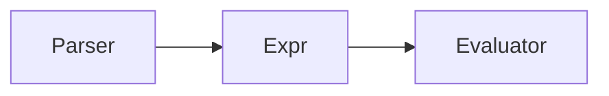

# Lalalang

This is a lambda-calculus interpreter

## Lambda-calculus basics

### Types of expressions

1. variable:
   ```x, y```
2. lambda abstraction:
  ```λx. x + x```
3. application:
  ```(λx. x + x) y```

### Irreducible expressions

- ```Y = λf. (λx. f(x x))(λx. f(x x))```

### Some examples


